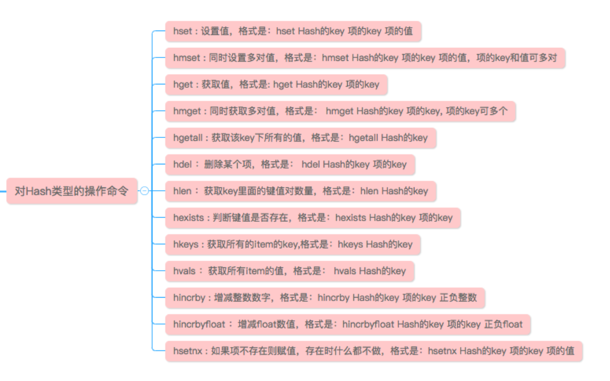
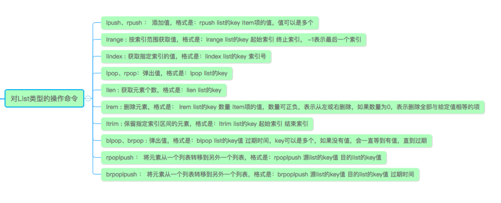
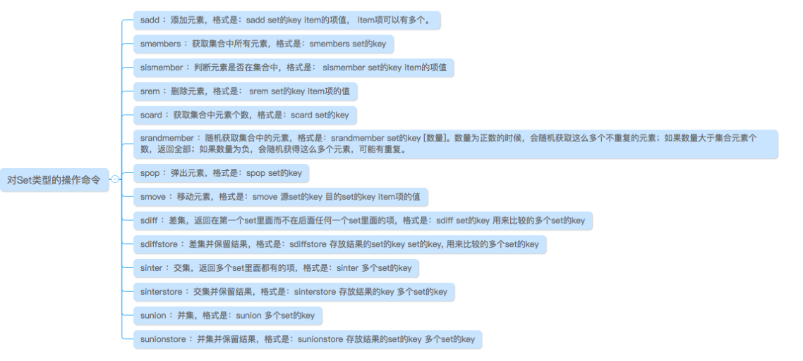
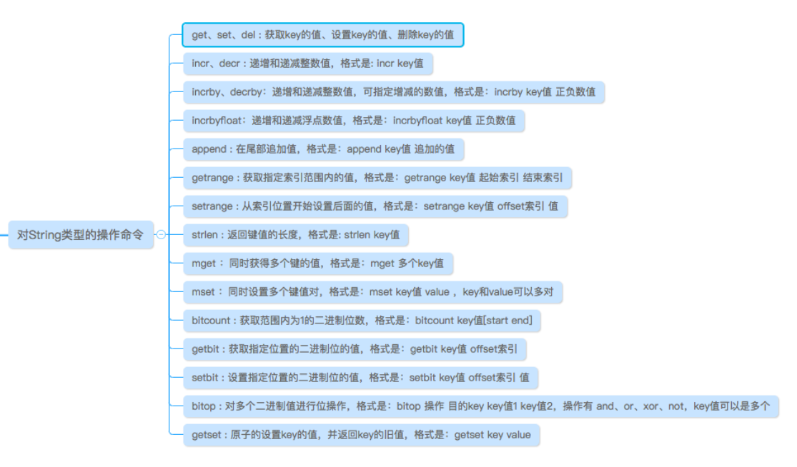
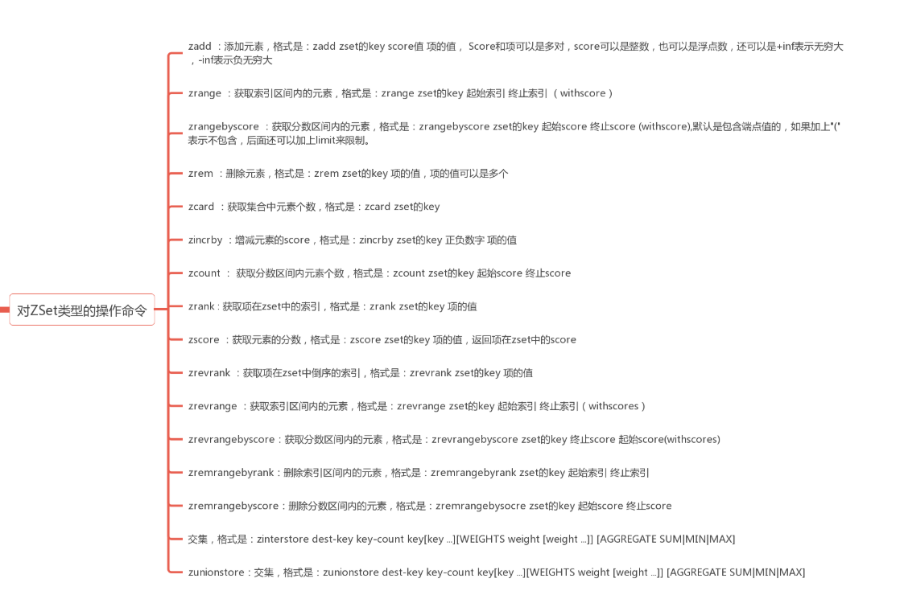

<h1>7.1</h1>

**1.短网址原理**
<ul>1.定义：类似于微博的那种 https://t.vn/xxxxxxxxxxx</ul>
<ul>2.流程：</ul>

	1.浏览器输入https://t.vn/xxxxxx
	2.dns获取ip地址
	3.向ip地址请求，服务器收到 路径xxxxx，进行查询，对应到相应的长网址
	4.用301的方式重定向

<ul>3.算法</ul>

	###要求
	1.每个长网址对应的短网址，要独一无二
	2.短网址要短
	3.不能是随机的，一个长的只能对应一个短的，相同的长网址进来也能是同一个短网址

	###自增序列算法（永不重复算法）
	利用mysql的id自增来实现，可以保证每个都重复
	并把id值，通过进制转换，变成短字符串，比如36进制 [0-9a-z]，也可以更多 [a-zA-Z0-9] 等等，总之1亿在36进制也就6位而已

	###注意点
	1.长链接申请创建时，先查查有没有，这样就解决了相同的问题，但是长字段查起来有太慢，可以对其做hash
	2.模拟哈希索引

	   新建一列用于存储该字符列的hash值（哈希函数不要使用SHA1(),MD5(),因为会产生很长的字符串，浪费空间，比较也慢，最好是返回整数的hash函数），在该列建立索引，查询时必须在where子句中包含常量值，以避免hash冲突
	
	      例如： SELECT  id FROM url
			    WHERE url_hash = hash('www.blog.csdn.net')
	            AND url = 'www.blog.csdn.net'

<ul>4.自定义短码的处理</ul>

	###自定义出现的问题
	用户自定义了一个，占了一个id的位子，那么这个id就被浪费了
	且如果由其他id生成的短码，已经被自定义过了呢

	###解决
	id生成的，发现被自定义过了，就把这个自定义的行对应的id拿过来，反正这个id空着的，用这个id去生成，再被占用就继续，反正位子多
<ul>链接：https://www.jianshu.com/p/43eea66a2235</ul>

**2.杂**
<ul>hash的引用场景</ul>
<ul>更加细化的去重，比如同一域名下的很多网址，全部拿来去重很没效率</ul>
<ul>生成唯一id</ul>
<ul>SHA1(),MD5()??返回整数的hash函数？</ul>
<ul>手写多线程</ul>
<ul>互娱和雷火都开始了，准备投，还有阿里</ul>

**3.TopK问题**
<ul>1.问题描述：从一堆数中找出最大或者最小的 K 个数：相应的，数据量会非常大，先排序再找，不现实</ul>
<ul>2.思路：用堆来做，在一开始，先创建大小为K的堆，对其进行初始化，如果是最大堆，顶上就是最大值，这时候遍历集合，和最大值比较，比最大值小就替换，重新调整，这样遍历完堆里就是最小的K个值</ul>
<ul>3.Java实现</ul>

	public static int[] topK(int [] nums , int k){
        if (k>=nums.length){return nums;}
        int[] res = new int[k];
        for (int i=0;i<k;i++){   //创建一个堆
            res[i]=nums[i];
        }
        for (int j = (k-1)/2 ; j>=0 ; j--){   //初始化这个堆
            shift(res,j);
        }
        for(int item : nums){
            if (item<res[0]){
                res[0]=item;
                shift(res,0);
            }
        }
        return res;
    }

    public static void shift(int [] nums , int index){
        int i = index;
        int j = 2*i+1;
        while (j<nums.length){
            if (j+1 < nums.length && nums[j+1]>nums[j]){
                j++;
            }
            if (nums[i]<nums[j]){
                int temp = nums[i];
                nums[i] = nums[j];
                nums[j] = temp;
                i = j;
                j = 2*i+1;
            }else {
                break;
            }
        }
    }

<h1>7.3</h1>

**1.算法练习**
<ul>见 算法.md</ul>

**2.杂**
<ul>1.ArrayBlockingQueue 这里的公平锁，本质上，就是重入锁的公平锁，就是在释放锁的时候，下一个拿到的是不是符合公平原则</ul>

<h1>7.5</h1>

**1.算法练习**
<ul>见 算法.md</ul>

**2.杂**
<ul>1.BFS就是广度优先遍历，一般使用队列来实现，DFS就是深度优先遍历，如果用数据结构写，就是栈，如果不是，一般就是回溯法</ul>
<ul>2.最短路径算法</ul>

	1.之前BFS用队列来做，是因为每个点之间的距离权重是一样的，此时加了权重，为保证最小所以需要用优先级队列，最小的在前
	2.狄杰斯特拉算法：主要是维护两个东西：1.从起点到终点的中间每个点的距离   2.每个点最短路径中的，上一个点  3.还有一个辅助的数组，表示哪些已经被搜索过了

	###大致思想
	首先从起点开始，写下起点到它能到的所有点的距离，到不了的就无穷大，把这个起点放进seen里面，表示已经搜索过了。

	下一步，从其余点中找出距离最小的点（注意，这个cost队列，存的都是到原点的距离），把最小的点作为起点，重复一遍，新距离是起点到该点的最短距离+到下一个点的距离，如果够小，就更新

	直到所有的都结束，都放进了seen为止

<h1>7.7</h1>

**1.倒排索引**
<ul>1.定义：顾名思义，和正向索引不同，是用value来索引key</ul>
<ul>2.应用场景：搜索引擎，Mysql全文索引等等</ul>
<ul>3.具体：</ul>

	比如，百度搜索“华为”，我要去找每一个网页，看看里面有没有华为两个字，找出来之后还要进行打分，给他排序，肯定是不行的，所以事先维护一个由“华为”字符做key，value是哪些文档含有它

	需要一个单词列表，每一项是包含的文档，再细致一点，可能还把频率，等等加进去

	单词列表的查询，可以像hashmap一样用数组加链表，也可以直接用树，还有在建立倒排索引之前，要先对文档进行分词，把单词找出来

	查询一个组合的字符，就对应他们的交集

**2.MySQL读写分离和主从复制**
<ul>1.关系</ul>

	主从复制是读写分离的前提

	有时候数据库压力很大，就可以考虑读写分离，一个数据库负责写，一个负责读，就可以提升一倍性能，但是为了保证两个数据库数据要一样，就必须用主从复制

	
<ul>2.主从复制</ul>

	1.主库要开启binlog的日志功能
	2.不同库的id要不一样
	3.保证连通

	主库做的每个操作，每个sql语句，都记录在binlog的二进制文件里，每当一个从库连接进来，主库就会新开一个线程，传到从库，从库这时候有两个线程，一个接受二进制并存到relay.log，还有一个，去串行执行语句

	###主库宕机？怎么保证数据不丢失？
	采用半同步复制，写进binlog的同时，本来是异步复制，不用管从库，但是现在不行，必须确保有一个从库接收到了，才会显示commit成功，保证了不管主库宕不宕机，总是有一份数据是完整的

	之所以是叫半同步，是因为当等待时间超过一定设置值，主库就不管他了，退化成异步复制

	###从库是一条一条来的，太慢数据延迟咋办
	有一个并行复制，是从库的relay进行并行，5.7版本新增，主库怎么并行执行，从库就怎么并行
<ul>3.读写分离</ul>

	一台服务器负责insert,update操作，另一台负责select，前提是两者之间数据同步

	1.代码上实现，插入更新操作发到写服务器，查询操作发到读服务器。
	2.通过数据库中间件（mycat,阿里的Cobar）

**3.mysql分区分表**
<ul>1.水平拆分：比如按年查询的，就把今年的分出来，因为被查的几率大嘛</ul>
<ul>2.垂直拆分，一个表的字段，可以拆成多个表，在查的时候，单独去查，代码层拼起来就好</ul>
<ul>3.垂直拆分可能会有分布式事务的问题，就按照分布式锁来</ul>

<h1>7.8</h1>

**1.分布式ID生成器**
<ul>1.要求：</ul>

	1.肯定要不一样啊
	2.最好是递增，方便查询
	3.高可用，单点挂了可不行
	4.ID要短一点，方便存，占用空间不能太大
	5.批量生成

<ul>2.生成方式</ul>
	
	##snowflake
	一个id有64bit
	首先第1bit空着，为0
	2——41bit是当前的时间戳到某个时间的毫秒
	后面的10bit是机器id，这样就是2的10次，可以有1024台机器
	最后12bit，就是代表，该机器当前单位时间内（毫秒），能生成的数量，这里是4096，那样一秒就是4096000，QPS很大了

	实际上，上面的东西可以进行调整

	###其他方法
	1.用mysql主键，但是单机版的可能不太行，主从的话，还要考虑主从复制
	2.UUID，这样就不保证递增（随机）
	3.直接根据当前时间来，这样就不能批量了
<ul>3.链接：https://www.jianshu.com/p/2e57acbe4a19，下方的refer也很好</ul>

2.**redis操作**
<ul>1.String</ul>

	1.set key value / get key / del key
	2.incr/decr key : 自增或自减
	3.incrBy/decrBy key num :自增或自减某个数
	4.append ：加在最后
	5.getRange key start end(后包括) / setRange key start offset
	*6.setnx key value
	7.mset key1 value1 key2 value2/这个也有setnx版本

<ul>2.list</ul>

	1.LPUSH/RPUSH key value [value ...]
	2.LPUSHX/RPUSHX当key存在时才插入
	3.LRANGE key 0 -1
	4.LINDEX key index/LSET key index
	5.LREM key count value
		count > 0 : 从表头开始向表尾搜索，移除与 value 相等的元素，数量为 count
		count < 0 : 从表尾开始向表头搜索，移除与 value 相等的元素，数量为 count 的绝对值
		count = 0 : 移除表中所有与 value 相等的值
	6.BLPOP/BRPOP：阻塞操作，并有timeout
	

**3.redis的底层**
<ul>1.String：String可以存整数，可以存动态字符串，关于字符串，类似于数组，叫做SDS，里面主要三个变量，字符长度len,尚未使用的buff缓冲区长度，还有字符数组，所以相应的，len操作就是O(1)</ul>
<ul>2.List</ul>

	3.2版本以前的老版本，是ziplist和linkedList混用的，当元素少于512且都小于64字节，用ziplist，不然就转码成Linkedlist，新版本用的是quickList，是两种的混合，大层面是linkedlist,但是其中的每一段是ziplist

	##ziplist
	本来一个链表，需要一个节点，然后用前后指针连接起来，浪费内存空间，现在直接用一块完整连续的内存，来做这件事情
	###linkedlist
	双向链表

<ul>3.Hash</ul>

	当元素少于512，且都小于64字节，就用ziplist,不然就用hashtable，这里的hashtable，和java的hashmap差不多，用的是数组加链表.

	而这里的当超过负载因子，也需要扩容，或者缩容，然后rehash。但是这里不是一次性就rehash，采用渐进式的。

	假设元素很少，一次性弄完就好，假设元素很多，就很耗时了，而且redis是单线程，会卡住。所以，当要扩容时，先申请数组，但不立马搬移，当有修改，插入的时候，就插入在新数组，同时从老数组搬运一个到新数组，这样其实同时有两个数组在工作，当全部搬移成功，老数组就淘汰了，这就是渐进式rehash
<ul>4.Set</ul>
	
	主要是intset和hashtable

	当集合里都是整数，而且元素不多，就用intset，不然用hashtable，set这里用hashtable是可以的，只不过value都是null
<ul>5.Zset</ul>

	ziplist和skiplist（跳跃表）

	###跳跃表
	一开始是一个head头结点，头指向跳跃表的头，尾指向跳跃表尾巴。最开始有一个节点，上面每个元素都有，可以理解为权值为0，每一个元素都有前进指针和后退指针，同时伴随着step，比如，向前一步，就到了权值为1的节点上，所以，相应的，每个权值的节点，都是有每个元素的

	###
	跳跃表查询删除平均o(logn)，最坏N

	链接：https://blog.csdn.net/universe_ant/article/details/51134020
<ul>用途</ul>

	String：缓存、限流、计数器、分布式锁、分布式Session
	Hash：存储用户信息、用户主页访问量、组合查询
	List：微博关注人时间轴列表、简单队列
	Set：赞、踩、标签、好友关系
	Zset：排行榜

<h1>7.9</h1>

1.Redis 与 Memcached

<ul>1.数据类型:Memcached 仅支持字符串类型，而 Redis 支持五种不同的数据类型，可以更灵活地解决问题。</ul>
<ul>2.数据持久化:redis可以，memcached不可以</ul>
<ul>3.Memcached 不支持分布式，redis可以做集群</ul>
<ul>4.内存管理机制：在 Redis 中，并不是所有数据都一直存储在内存中，可以将一些很久没用的 value 交换到磁盘，而 Memcached 的数据则会一直在内存中。</ul>

2.抽象类与接口的区别
<ul>1.定义上：接口是public interface ，里面只有方法名，抽象类是定义时加上abstract，里面可以有不是抽象的方法（注意，抽象类可以有私有变量和私有方法，而且抽象方法只有名字）</ul>
<ul>2.性质：都不能被直接实例化，一个普通类可以继承多个接口，但只能实现一个抽象类</ul>
<ul>3.构造方法：接口里面的变量都是static final的，不能有构造方法，也不需要，因为构造方法的初始化顺序在最后，而抽象类就可以有构造方法，因为除了抽象方法，另外没有区别</ul>

<h1>7.10</h1>

**1.hashmap为什么容量都是2的幂**
<ul>在计算数组下标时，调用indexFor方法，里面是 hash&(length-1) ,当扩容前容量是16，len-1就是01111，扩容后容量是32,len-1就是011111 ，仅仅是多了一个1，那么在 & 的时候，只要多出来的那一位是0，下表就是不变的，是1，那就是之前的两倍，rehash就会省下很多计算消耗</ul>

**2.hashmap为什么链表大于8，就变成树，小于6就退化成链表**
<ul>红黑树的查找长度是 logn ,log8=3 ，而链表的平均查找长度是 0.5length , 在这里就是4，所以优化，为什么不是7呢？因为7+1就是8，7-1就是6，太容易波动</ul>

**3.hashmap jdk7 rehash死循环**
<ul>1.起因：jdk7用的是头插法，不仅仅是扩容是头插，平时插入元素也是头插</ul>
<ul>2.</ul>
<ul></ul>

4.分布式学习
<ul>1.分布式锁</ul>
	
	1.基于mysql主键，但是没有超时的限制，而且不可实现重入锁
	2.redis setnx ，set if not exist，当链接断开时，因为有expire的存在，可以超时删除，而且string可以实现自增，就可以实现重入锁。唯一的问题是，当A超时，B,C检测到，同时去删除A并更新自己的，C可能删除掉B刚才更新的，那样B,C都有锁了。这个问题，当检测到超时，第一时间先别删，先去getstat一下，如果发现不是A，就不删除了，因为锁已经被人拿走了
	3.zookeeper,在某一目录下创建临时节点，比如在 /lockxai 创建，因为节点会有自增的序号，这样如果是最小的序号，就说明拿到锁了,没拿到的监听自己前一个节点，前一个被删除了，自己就是了。至于可重入，在代码端设置一个state就可以实现可重入了

<ul>2.分布式事务</ul>
	
	###CAP
	一致性（C：Consistency）、可用性（A：Availability）和分区容忍性（P：Partition Tolerance），一般只能实现两个

	###BASE
	基本可用（Basically Available）、软状态（Soft State）和最终一致性（Eventually Consistent）
	基本可用很容易理解，软状态就是允许不同系统间存在中间状态，允许数据在同步的过程中有一定延迟，最终一致性就是，只要保证最终是数据一致的就可以

	###2pc(两阶段提交)
	设置一个协调者，和其他的参与者，协调者发出执行事务的命令，让每个参与者都去执行，但是都不提交，每个参与者会把结果返回给协调者，如果每个参与者都OK，协调者就发送commit的提交命令，让每个参与者都提交，一旦有一个不行，就全部回滚

	缺点：1.参与者在等其他参与者确认的时候，有很大延时。  2.协调者是单点的，故障怎么办？  3.发出去的命令是可能丢失的，有的参与者没收到，就会有数据不一致性   4.机制太保守，一个不行，就全部回滚

	###消息中间件做分布式事务

	###3pc（三阶段提交）
	在最前面加上了一个询问的过程，协调者询问参与者，参与者预估一下能不能成功，并返回。这一步增加了一次检查，避免了许多不能成功提交的情况。再者，在协调者和参与者上都加上timeout，超时就默认提交，这是根据概率学来的，基本都是成功的

<h1>7.11</h1>

1.常见笔试题

2.paxos算法，还有他和zab的关系
<ul>1.流程</ul>

	首先有三个角色：Proposer(提案者)，Acceptor(决策者),learner（学习者）。首先Proposer（不管多少个）先生成自己的提案id，注意，每个人的提案id都是唯一且自增的。如果最开始没有现成提案内容，就用自己的
	
	现在，提案者发送提案给所有决策者。决策者有着两条原则：
	1.不接受比已持有提案id还要小的提案，也就是，我收到过6的，你给我个5，我就不理你 
	2.如果决定接受，就返回已经拿到过的最大提案的内容

	现在终于开始讲解流程
	首先，决策者先进行试探(prepare)，发送一个带着提案id的空提案给超过半数的Acceptor，两个目的，第一，确保半数的已经准备好了，第二，如果已经有批准的提案，学习之，因为Acceptor会返回。在这里，如果收到了半数确认，就进入下一阶段，发送正式内容，如果没有，就增加id，再来一次，直到ok为止

	经过一系列，终于要正式发送了。前面Acceptor没回复值的，就发送自己的内容，有回复值，就发送回复值，如果有半数的通过，就交给学习者，已经Ok了

	既然已经有了正式的通过提案，那么整个系统就都要学到。已经有一个通过了半数，那说明另外的都没有通过，都会被赶回去重新进行prepare阶段，他们再次发送，会得到已经通过的提案内容，因为Acceptor已经有了他们，这样，各个propsoer也会学到这个值

<ul>2.zab是它的变种</ul>

**3.redis秒杀场景设计**
<ul>1.要解决的难点：1.高并发的数据库压力和网络负载  2.实现正确的购买顺序，解决超卖等问题</ul>
<ul>2.高并发压力</ul>

	##阻挡掉大部分流量
	1.比如抢购场景，用户点一下卡住了，喜欢多点几下，这就造成了大量冗余，不必要的申请，这里可以在用户点击一次之后，就将按钮设置成不可点击，或者直接设置成一段时间内，用户只能发起一次请求

	2.还有不怀好意的脚本，绕过了按钮，直接访问接口，商城对每一个用户肯定有单独的userID，一段时间内，对同一id返回同样的内容，或者直接静态缓存页面，每次都返回缓存，拦截多余流量

	##设置redis缓存，减少数据库压力
<ul>2.超卖问题</ul>

	高并发下，两个线程同时查到还剩最后一件，两个线程都进行-1操作，就出现了超卖，这里可以使用redis，redis自身操作就有原子性。假设有1000件商品，那从一开始就设置一个List，里面是啥无所谓，反正每次进来都lpop一次，对用户而言，只有lpop成功，才显示成功，避免了超卖

	###异步操作
	而到了这里，就不用急了，把这些得到允许的操作，做成队列，让mysql慢慢来就行，不一定要追求很高的同步性

	###事务watch
	或者可以用redis事务中的watch来实现，监视一个(或多个) key ，如果在事务执行之前这个(或这些) key 被其他命令所改动，那么事务将被打断，实际上就是乐观锁了

<h1>7.12</h1>

1.**手写实现读写锁**
<ul>1.读写锁概念:对资源的访问，分为读锁和写锁，读操作可以共享，但是读的时候，不能被写，写的时候，又不能读，又不能写。所以总结就是，读锁上只可以加读锁，写锁不能加任何锁</ul>
<ul>2.wait() / notify()</ul>

	1.概述：这两个是object()上的方法，而且是final的，那也就是不能被重写
	2.wait():当已经获取当前对象锁时，让当前线程阻塞，变成wait状态，时刻等待唤醒，这里有两个注意点：一，前提是要先有锁，二，这里直接出让锁，Thread.sleep是睡眠，实际不出让锁
	3.notify和notifyAll：去唤醒正在等待的锁，实际谁拿到还说不定呢

<ul>3.实现</ul>

	private  int readCount = 0;
    private  int writeCount = 0;
    public void lockRead() throws InterruptedException {
        while (writeCount>0){
            synchronized (this){
                wait();
            }
        }
        readCount++;
        System.out.println("read lock");
    }

    public void unlockRead(){
        readCount--;
        synchronized (this){
            notifyAll();
        }
    }

    public void lockWrite() throws InterruptedException {
        while (writeCount>0){
            synchronized (this){
                wait();
            }
        }
        writeCount++; 
        while (readCount>0){
            synchronized (this){
                wait();
            }
        }
        System.out.println("write lock");
    }
    public void unlockWrite(){
        writeCount--;
        synchronized (this){
            notifyAll();
        }
    }

	###解决一直读累加问题
	在写锁方法里，提前writeCount++
	这里面其实都很巧妙
	while (writeCount>0){
            synchronized (this){
                wait();
            }
    }
	当拿不到锁，会一直循环，当拿到锁，又会出让，其实就是想等到跳出循环的那一刻

<ul>4.链接：https://www.cnblogs.com/DarrenChan/p/8619476.html</ul>

**2.一致性hash（今天面试问到了，学习一下）**
<ul>1.存在的意义，为了解决普通hash算法在分布式中的缺点</ul>
<ul>2.应用场景</ul>

	###
	比如，将图片缓存进redis，单机还没事，当因为性能，设计成集群，主从结构的时候，就问出现问题。当数据一大，就会分库分表，同一类的缓存可能会存在不用的redis上的，要用的时候，每台服务器去找肯定不现实，所以在这里用到hash算法，O(1)的复杂度就定位到相应的服务器

	但是，假设现在有5台，hash函数 xx%5 ，数据被存在其中一个了，这时候撤掉一台机器，那每个缓存是不是都要重新rehash一下？？？这时候，就出现了一致性hash，让机器数量虽然改变，大部分的缓存还是不用变位置

<ul>3.原理</ul>

	简单的hash函数，使用机器数量做除数来取余，现在进行修改，使用 2^32作为除数，让结果落在 0~2^32-1上，把这些下标抽象在一个环上，按照顺时针大小递增的一个环，每台机器的hash分别落在环的不同位置。

	现在，当每一个缓存进行hash，肯定也是落在环上，那么从落脚点往顺时针走，最先碰到的服务器就是他缓存的地方
<ul>4.优点</ul>

	1.使用定值2^32做除数，而不是机器数量，当机器数量改变时，大部分数据的hash不需要更改

	2.当机器数量更改，变动的只有一小段的数据，这一段会定位到新的服务器，仅此而已
<ul>5.细节上的小问题</ul>

	##为什么除数是2^32
	考虑到，服务器都是要hash到环上的，肯定不能有重复啊，而且考虑到扩展，要留下足够的空间，而java中int最大就是2^32，一个int是4个字节，一个字节8位，那当然是32位

	##hash倾斜的处理
	服务器比较少，而且hash出来很近，这就导致后面一个节点，只能被上一个到它自己这一段很小的距离内的数据找到，其他大部分都到了另一个服务器上，毕竟是顺时针找嘛。

	这种时候，创建好几个虚拟节点，故意弄不同的值，让hash出来的点稍微均匀一点，让其中的交叉排布的若干点指向A，另外指向B，这样即使数量少，也会比较均匀

	##链接
	https://www.cnblogs.com/study-everyday/p/8629100.html#autoid-2-0-0
<ul></ul>

3.杂
<ul>1.hash出来的都是整数？？？hash具体算法有哪些？</ul>
<ul>2.redis 事务，watch??和乐观锁啥关系</ul>
<ul>3.接到offer就减肥！！！！！还有尽量早睡</ul>

<h1>7.13</h1>

1.杂
<ul>1.幂等性？？</ul>
<ul>2.select xxxxxxxxx for update，查询语句中涉及主键，就锁行，没有就锁表，直到commit提交事务才会被释放</ul>

<h1>7.15</h1>

1.下阶段目标
<ul>1.算法</ul>
<ul>2.dubbo</ul>
<ul>3.复习之前的</ul>

2.动态规划再学习
<ul>1.上次没做出的题目：最长递增序列</ul>

	###当时的想法
	一直纠结于一个元素，选或者不选。并尝试写一下方程，是F[n] = max(F[n-1],F[n-1]+1)，到了这里就卡住了，实在下不去了

	###正确思路
	其实这里应该是发挥，动态规划一个类似于数组的做法，新增一个数组，第N个元素表示，原序列前N个里的最大递增序列的长度。每当一个新的元素加进来，就遍历比较0~N-1的元素，找到符合递增的，最大的长度值，+1就好
<ul>2.经典的01背包问题</ul>

	首先想想能不能写出方程，发现写的出，F[i][j] = max(F[i-1][j],F[i-1][j-weight[i]+value[i])，意思就是说，第i个，不选就是沿袭i-1的值，选，就是i-weight的值加上第i个本身的价值
<ul>3.自己的总结：首先尝试写写状态方程，写不出别急，想想数组这种的行不行</ul>
<ul>4.最大子序列和</ul>

	这个问题老是考察，又老是忘记

	首先写下状态方程，一般是这么写，令f(n)代表前n个数中的最大序列和，如果前面的和小于0，那就不要了，直接是arr[n]，如果大于0，就是f(n-1)+arr[n]，按照道理是应该这么写，但是这里用f(n)不太合适，因为因为如果最大的子序列断了，就应该是新的了，不能再用f(n-1)代表之前的最大值，应该用sum这种，如果小于0，就置为0，并且每次都和max比较

	
<h1>7.16</h1>

1.二叉树（里面的有些递归，不太好写）
<ul>1.二叉搜索树的公共祖先</ul>

	说了是二叉搜索树，那就遵循左小右大。

	思路：拿到一个节点，进行判断，如果要找的两个点都在左边，说明都在左子树，那就用该节点的左节点，再来一次，右边的一样。结束的条件是，一个在左，一个在右，或者干脆和其中一个相等，这样，该节点就是最近公共父节点

<ul>1.普通二叉树（待补充）</ul>

2.netty和nio
<ul>1.传统io：基于字节流，是一个字节一个字节来的，但是NIO是根据块传输的，是一块一块来的</ul>
<ul>2.nio的本质：nio也叫new io，实际上是基于reactor模式的，多路复用的非阻塞IO</ul>
<ul>3.netty的流程：一般的服务端过程，创建两个netty自带的线程池，一个Boss，一个worder，boss用来accept请求，worker用来处理，随后创建serverboostrap启动类，在里面指定channel和对应的handler。这里的handler一般是一个pipeline一样的东西，里面add上实现的handler。具体的话，就是去重写里面的channelRead0方法，最里面最重要的就是bytebuf这个对象</ul>

3.粘包
<ul>1.粘包的定义：其实也就是包在被接受的时候，多个包黏在一起，或者两个包各一半，粘在一起，分不出来，本质上是包的边界问题</ul>
<ul>2.粘包出现的原因</ul>

	###协议设计层面(Nagle)
	tcp是基于流传输的，这样就是根据缓冲区大小来传输，而且tcp有一个nagle算法，会合并许多小的包，只进行一次传输，来提高利用率，不然会有许多很小的包，却占用了大量传输资源。但是，这样就会造成多个包粘在一起的情况，就是粘包

	###发送端
	不足缓冲区，就会有nagle算法，超过缓冲区，就会分成多个包
	###接收端
	接受的太慢，一个包还在缓冲区，另一个也来了

	###另外层面(消息边界)
	消息边界，就是保证了，一个包，就是一条消息，肯定会被接收端进行一次接收，不存在多个包一起的情况，所以udp就没有粘包问题，而tcp是流传输，就是没有消息边界的意思
<ul>3.怎么解决</ul>

	1.从协议角度，直接禁用Nalge算法

	2.使用场景角度，只做一锤子买卖，发送的只发一次，接受的也只接受一次，直接立马关，下次要用，重新建立连接

	3.编程角度：使用定长数据包，或者用特殊字符做边界符，也可以使用“长度+内容”的形式，不然的话tcp每次都强制发送，不等缓冲区

	4.接收端角度：优化消息处理速度，也就是处理的快一点，不要老是堆在缓冲区

4.算法
<ul>1.最长回文子串</ul>

<ul>2.判断是否回文串</ul>

<h1>7.17</h1>

**1.Reactor模式**
<ul>1.Reactor模式</ul>

	Reactor模式就是专门为了处理高性能并发的，有这么几个部分

	Handle:就是要被监听的对象，比如网络编程里的Socket对象，放在Java NIO里就是Channel，也就是请求触发的地方
	Synchronous Event Demultiplexer：也就是接受请求的地方，放在其他地方就是linux的 select函数，Java里的Selector模型
	Initiation Dispatcher：管理执行Handler的东西，对应netty就是NioEventLoop
	Event Handler：那就是netty里的handler了

	###总结
	说句简单的，来了很多请求，先经过selector,然后下达给dispacth进行分发，发给相应的handler。就这么简单，具体还有其他细节
<ul>2.reactor的三种模型</ul>

	###单reactor线程模型
	reactor是单线程的，handler的处理过程也在线程里，一个太慢，会影响其他的

	###单reactor多线程模型
	reactor还是单线程，但是现在，下发到handler的时候，除了read/send之类的io请求，其他的逻辑，统统交给其他的线程。这里用了线程池

	###多reactor多线程模型（netty就是这样的）
	reactor单线程总是有性能瓶颈，所以这里干脆按照功能分开。分为mainReactor和subReactor，main只负责accept请求，下发到相应的sub上，sub再进行dispatch
<ul></ul>

**2.netty和reactor**
<ul>1.对应</ul>

	netty其实就是实现了reactor的多reactor多线程模型
	一般使用的bossEventLoop就是mainReactor，workerEventLoop就是sub的，然后经过ServerBootstrap的配置，channel就是模型里的handler，也就是socket，再下面有一个channelPiple ，上面可以add很多具体的handler

**3.NIO和netty的相关问题**
<ul>1.AIO/BIO/NIO：AIO是异步的，同步异步区别在弄完之后，服务端会不会通知你，至于NIO要分java中的，还是linux的</ul>
<ul>2.NIO的组成</ul>

	Channel
	Buffer
	Selector
<ul>3.NIO和传统IO的区别</ul>

	###传统IO
	1.基于字节流/字符流，总之基于流，按顺序的，一个字节来读
	2.流是单向的，所以有输入输出流
	3.是阻塞的
	4.没有selector

	###NIO
	1.基于channel和buffer，是按照块来传输
	2.channel是双向的
	3.非阻塞（要么读到当前可读的，要么啥都没）
	4.有selector，实现类似多路复用的机制（channel的rigister方法，参数:selector实例，常量型的事件类型，但是channel必须先设成非阻塞，还有selector的keys方法，返回准备好的channel）
<ul>4.NIO和netty搭建简单服务端</ul>

	

	
<ul>5.netty零拷贝</ul>

	###linux零拷贝和netty零拷贝的区别
	linux就是真的，想从内核区，不经过用户区，直接到网络，而netty这里，已经是在jvm中了，所以不能算，只能算是，减少拷贝的次数，减少拷贝量

	###CompositeByteBuf
	想把两个数据合在一起，新创建一个bytebuf，再添加进去，就拷贝了两次，用CompositeByteBuf，添加进去，实际上是逻辑组合，没有拷贝

	###包装wrap
	想把byte[]数组这种变成bytebuf，拷贝进来太浪费资源，Unpooled.wrappedBuffer方法进行包装，还是共享之前数组的地址，不进行拷贝

	###拆分slice
	这次是拆分，slice(int index, int length)，不copy，相当于共享了同一个bytebuf的不同地址而已

	###FileRegion 
	这里的FileRegion 和nio 里的FileChannel一样，有一个transferTo的方法，直接从一个channel转移到另一个channel，不需要buffer缓冲区

<h1>7.18</h1>

1.**自定义类加载器**
<ul>1.流程：首先继承classloader，实现里面的findclass方法，findclass方法里有defineclass方法</ul>
<ul>2.详解</ul>

	loadclass:一般不重写，逻辑是每次都交给父加载器，如果都找不到，就调用findclass
	findclass:默认为空，子类自己实现，里头是读取类的相关内容，并调用defineclass
	defineclass:把字节码变成class，字节码就是byte[]

2.**用户区和内核区**
<ul>Linux有4G的虚拟地址空间，最高的0-1G作为内核空间，剩下的座位用户空间，因为内核空间共享，所以每个进程都可以说是4G空间，但是用户空间独立，而且不共享</ul>

3.static用法
<ul>1.概述：static，就是没有this的意思，么的实例对象的意思</ul>
<ul>2.修饰方法：static方法，就变成类方法，用类来调用，相应的，因为脱离了对象，所以静态方法里不能调用非静态方法，但是相反，非静态可以调用静态的</ul>
<ul>3.修饰变量：static变量，和上面的一样，是属于类的，但是可以被非静态调用</ul>
<ul>4.静态代码块：在初始化时，按照顺序初始化，但是有一点，静态代码块只会被加载一次</ul>
<ul>5.其他：static的变量虽然是属于类的，但是通过对象，也是可以访问到的</ul>

<h1>7.21</h1>

1.内部类
<ul>1.特点：内部类可以任意访问外部类数据，外部类创建实例，就可以访问任意对象</ul>
<ul></ul>

2.**布隆过滤器(bloom filter)**
<ul>1.作用：判断某个元素是否在集合中，取代了hashmap在大数据量中去重的地位</ul>
<ul>2.原理</ul>

	1.首先是一个bit数组，里面初始化都置为0
	2.同时给出K个不同的hash函数
	3.元素进来时，计算出K个hash值，把下标对应的位置写成1
	4.下次查询时，如果对应位置都是1，就说明有
<ul>3.优缺点</ul>

	###优点
	1.省内存
	2.查询快
	3.查询但是不保存，对数据有安全性
	

	###缺点
	1.有误报可能性(但这里的误报是，说是已存在的，可能不存在，但说是不存在的，就一定是没有，因为查询K个hash值时，可能某个位置被其他的元素已经变成1了)
	2.不支持删除，因为bit位上是0和1，删了一个，其他的相关的元素咋办（或者用计数法，但是就违背了用bit的初衷，节省内存）
<ul>4.其它问题</ul>
	
	###为什么是k个hash函数，一个不是够了吗
	不行。单hash函数，发生冲突的概率很大。有句话很好，想把冲突绿降到1%，就要把bitset大小变成100倍

	###hash函数K值的控制，还有bitset大小的控制
	K越大，覆盖的位数就越多，误报率也就越大，K越小，就越接近单hash冲突。而set长度越大，内存消耗越大，误报率的确会降低，set长度越小，很快的大部分位都会置为1，误报率变大

<ul>5.场景：1.去重(爬虫)  2.用redis做一个缓冲层，先判断有无，就不用每次都查后端数据库，减少数据库压力，但同时，hash函数的效率要保证</ul>

3.**MVCC**
<ul>1.概述：MVCC也就是俗称多版本控制，实现了mysql的读已提交，可重复读。</ul>
<ul>2.作用</ul>

	MVCC和java的copy and write有点像，就是读和写是分开的，分别有多个快照，MVCC也算是乐观锁的体现，不仅仅是mysql，其他数据库也在用，只不过实现细节不太一样

	innodb默认可重复读的级别，用mvcc做到。是因为读未提交，需要每次都是最新的，不需要mvcc来做，串行化又做不到，这个需要锁来实现绝对的串行化
<ul>3.原理：</ul>

	这里以行级为单位，可以说，每一行里面，都会有两个字段，创建的版本号，和删除的版本号，而每一行，都可以有很多份快照，而查询的时候，从来都是查询符合条件的最新快照

	##插入
	就是插入，创建版本号设置为当前的事务id，删除版本号unDefine未定义
	##删除
	这里就是逻辑删除，定义删除版本号为当前事物id
	##更新
	为旧数据行的删除版本号赋值，重新添加一个数据行快照，并定义创建版本号，在这里才会出现同一行数据的不同时期的快照
	##查询
	这是重头戏，查询遵循两个原则
	1.查询版本号小于等于当前事务id(很容易理解吧，版本号大于当前的，要么现在这个时候还没插入，要么是在未来被修改了，总之现在还看不到这个快照)
	2.删除版本号要么没有，要么就是大于当前事务id，否则小于当前的话，说明早就被删了，无效了
	
<ul>4.解决的问题</ul>

	1.实现读已提交：很容易理解，你不提交，哪来的版本号？
	2.实现可重复读：同一事务内，你另一个事务提交的变化，我这里查不到，因为版本号有限制

4.Mysql Group by

5.java可重入锁里的读写锁？？

<h1>7.22</h1>

1.杂
<ul>1.mysql突然打不开：本来我是设置成服务的形式，开启才能用，但是不知道为啥，服务直接消失了</ul>

mysqld --install MySQL --defaults-file="F:\mysql\mysql-5.7.9-winx64\my-default.ini"
<ul></ul>
<ul></ul>

2.java异常机制
<ul>1.关键字：</ul>

	try：里面是可能报异常的代码
	catch：捕获异常，可以有多个catch的代码块，但是只能捕获一个，所以一般小的细的放在前面，大的放在后面
	finally：放在finally中的，保证会被执行。但是有个问题，try中的代码return或者throw咋办，其实是这样，当要返回时，必须要先执行finally代码，才会走到return这一步，但如果finally里头也有return，就直接返回了，不回去上面的return了
	throw,throws：注意喽，throw是主动去抛出，throws是跟在方法后面，声明有这些异常抛出
	
<ul>2.两种异常（还要斟酌一下）</ul>

	###check异常
	编译期异常，这种在编译时就可能报错的，java要求必须要捕获，不然通不过编译（就是除RuntimeException以外的异常）

	###runtime异常
	运行时异常，就算出现这种异常，编译时也看不出来，还是可以编译的，只不过跑起来报错而已（RuntimeException）

	###其他
	RuntimeException一般是程序自身程序的错误，比如空指针，数组越界，除零，类型转换错误，这一类，编译的时候不会被查出来，所以也不用强制去捕获

	IOException这个就是java层面出现的错误，比如IOException：操作输入流和输出流时可能出现的异常，EOFException，文件已结束异常，FileNotFoundException，文件未找到异常
	

	
<ul>3.异常类</ul>

	1.Throwable:这些类的父类，只有继承了它，才可以被抛出异常和错误
	2.error：和异常相对，是错误。不被catch捕获，而且程序不处理，一般是java虚拟机本身的错误，比如StackOverflowError最经典栈溢出，还有内存溢出，还有classNotDefineError等，没这个方法，没这个类等等的，也都是错误，是Error
	3.Exception:这就是异常了，这里面又分RuntimeException和IOException。

<ul>4.补充</ul>

	try 块：用于捕获异常。其后可接零个或多个catch块，如果没有catch块，则必须跟一个finally块。
	catch 块：用于处理try捕获到的异常。
	finally 块：无论是否捕获或处理异常，finally块里的语句都会被执行。当在try块或catch块中遇到return语句时，finally语句块将在方法返回之前被执行。在以下4种特殊情况下，finally块不会被执行：
	1）在finally语句块中发生了异常。
	2）在前面的代码中用了System.exit()退出程序。
	3）程序所在的线程死亡。
	4）关闭CPU。

<h1>7.23</h1>

1.编程之美
<ul>1.数组中一个数超过半数</ul>

	这个以前做到过，但是没有很透彻。其实可以这么想，一个数超过半数，现在我删除两个不同的数，要么里面有一个是目标数，要么都不是，但是不管是不是，剩下的数中，目标数还是超过一半

	这样就很容易理解了
	num = null
	count = 0
	for each{
		if i==num ： count++
		else: count--

		如果count为0，遇到新的数，就更新	
	}
<ul>2.题目改改，有3个数，每个都超过四分之一，找出来</ul>

	前面是一个数，一个count，现在弄成一个hashmap，设置三个数和次数，遍历，如果是三个数里的，++，不是，统统减一，当有次数为0 ，就更新

<h1>7.24</h1>

1.一个数出现一次，另外都出现两次
<ul>1.思路：一个数对自己异或就是0，从第一个数开始，遍历异或下来，出现两次的都变成0，只有那个一次的留下来</ul>
<ul>2.题目改改，有两个数出现一次</ul>

	这个麻烦点，首先按照流程走，得到这两个数的异或，这个异或中为1的位，就是这两个数不一样的地方，按照这个位，把整个数组分成两份，再进行就可以

<ul>3.题意改改，一个数组中，少了一个数，怎么找？</ul>

	解法：原来和-现在和
	如果多个一个数？一样
	如果一次性少了两个数？？先是，原来和-现在和，得到丢失两数的和，再同样类似得到两个数的积，就可以列方程算

2.大数乘法
<ul>1.超过int表示范围的数相乘，怎么做</ul>
<ul>2.思路：</ul>

	模拟我们人算来做。每一位的数，分别乘另一数的每一位，相加，就是某一位的数，这时候考虑进位

	两重循环，每一个数去乘，下一层循环的每一个，保存在res的 i+j+1处，因为可能有进位

	def bigNumCh(a,b):
	    lenA = len(a)
	    lenB = len(b)
	    res = [0 for i in range(lenA+lenB)]
	    for i in range(lenA):
	        for j in range(lenB):
	            res[i+j+1]+=a[i]*b[j]  //这里有进位
	
	    for k in range(len(res)-1,0,-1):
	        if res[k]>10:
	            temp = res[k]
	            res[k] = temp%10
	            res[k-1] += temp//10
	    print(res)

	a = [7,7,7]
	b= [8,8,8]
	bigNumCh(a,b)

3.从数组中找出和为K的2个数
<ul>1.解法：双指针法，前提是经过排序，一个指针从头开始，一个从尾开始，相加小于，前面的指针向后一位，大于，后面的向前一位</ul>
<ul>2.改题目，找出和为k的所有组合</ul>

	这样就复杂很多，考虑使用回溯法，一提到回溯法，一般都有队列之类的影子，加入队列进行下一层递归，如果失败就返回来，从队列里拿出来再做

	map = []
	numList = [1,2,3,4,5,6]
	### numList是数组，start是当前加到的位置，sum是已经加上的和，havaList是已经加上的集合
	### 思路：这么一个函数递归，如果加上去超过了，就return退出去，如果ok，就打印，如果小了，就继续下去
	def find(numList,target,start,sum,haveList):
	    path = haveList
	    if sum+numList[start]>target:
	        return
	    elif sum+numList[start]==target:
	        path.append(numList[start])
	        print(path)
	        path.pop()
	        return
	    else:
	        sum+=numList[start]
	        path.append(numList[start])
	        find(numList,target,start+1,sum,path)
	        sum-=numList[start]
	        path.pop()
	        find(numList, target, start + 1, sum, path)
	
	
	find(numList,6,0,0,[])

	
<h1>7.26</h1>

**1.spring aop原理**
<ul>1.概述：spring aop里面有两种jdk动态代理，和cglib</ul>
<ul>2.jdk动态代理</ul>

	这个概念和静态代理分开来，静态代理一般是有一个接口，一个实现的类（被代理类）和一个代理类，在代理类的构造中传入被代理类，在外面调用代理类就行

	但是静态代理有问题，耦合度很大，而且每次需要一个代理类，就需要新建一个代理类，所以需要动态代理

	主要是一个接口InvocationHandler和一个通用代理类Proxy。首先实现接口，重写里面的invoke方法，参数有被代理类，要代理的方法，和参数。实现完之后，调用Proxy的newInstance方法，传入类加载器，要代理的接口，和自己的InvocationHandler  

	因为这个是依赖接口的，所以只能适用于实现接口的类和接口上方法
<ul>3.cglib代理</ul>

	上面jdk动态代理基于接口，没有接口的情况就要用cglib代理。

	首先实现MethodInterceptor接口，重写里面的intercept方法。然后就是一个Enhancer的增强对象

    enhancer.setSuperclass(HelloService.class);
    enhancer.setCallback(new MyMethodInterceptor());
    HelloService proxy= (HelloService)enhancer.create();
    proxy.sayHello();

	本质上，就是通过反射让生成的代理类继承父类，成为它的子类，通过继承的方式，完成代理，所以很重要的，当父类中final方法，因为不会被继承，所以不会被代理

	jdk动态代理中调用方法用反射，cglib不是，而是根据一个Index来定位要使用的方法，有点类似于索引了

<ul>4.spring的使用：spring会根据实际情况，有接口就用jdk动态代理，没有接口只有实现类，就用cglib</ul>
<ul></ul>

**2.昨天复习的基础**
<ul>1.面向对象和面向过程：面向对象效率低一点，因为要实例化对象啊，但是面向对象有几个特征，封装，继承，多态，代码更好写，C是过程，C++和Java是对象</ul>
<ul>2.Java和C++比较：Java没有指针，而且是单继承，C++是多继承，还有Java自动内存回收</ul>
<ul>3.每个数据类型的大小</ul>

	int:4字节（相应的，short2字节，long8字节）
	char：2字节
	byte:1字节
	float:4字节（相应的，double8字节）
	
<ul>4.关于继承：只能继承父类的非私有方法，就是说，private不可以，public和protected可以，而且子类在重写方法时，权限不能小于父类，因为按照原则，父类能用的地方，需要子类也能用</ul>
<ul>5.protected：包内可见，而且对子类也可见。这里的意思其实是，同一个包下，继承过来的，可以在外面通过对子类的调用，访问到父类的方法，但是不同包，就访问不到。只有在子类重写方法后，才能拿到子类重写过的东西</ul>
<ul>6.StringBuffer线程安全，StringBuilder线程不安全</ul>
<ul></ul>

3.遗留
<ul>1.自己动手实现ioc和aop</ul>
<ul>2.复习：子数组最大和，最长连续子数组，动态规划</ul>
<ul></ul>
<ul></ul>

4.数组循环移位
<ul>1.题目：比如1234abcd,要求右移4位，求结果，结果显然是abcd1234</ul>
<ul>2.题解：</ul>

	把要移位的字符串分成两部分，要被移到前面去的，和不动的，比如1234abcd，把1234和abcd分别逆序，变成4321dcba,然后对整体进行逆序，就变成abcd1234

	def swap(nums,a,b):
	    while a<b:
	        nums[a],nums[b] = nums[b],nums[a]
	        a+=1
	        b-=1

	def rightmove(nums,k):
	    length = len(nums)
	    swap(nums,0,length-1-k)
	    swap(nums,length-k,length-1)
	    swap(nums,0,length-1)
	    print(nums)

5.字符串移位包含
<ul>1.题目：给两个字符串s1,s2,问s1的所有移位新字符串中，包不包含s2</ul>

	打比方：s1是 AABCD ，s2是 CDAA ,s1经过移位变成CDAAB，就包含了
<ul>2.题解：s1再怎么移位，都逃不脱 2倍s1的命运，也就是说，移位出来的东西，一定是 AABCD AABCD的子串，所以只要判断s2是不是两倍s1的子串就行</ul>

<h1>7.27</h1>

1.计算字符串相似度
<ul>1.题目：两个字符串，一个通过增删改，让两个字符串相等，比如abc和abd，只有一个不一样，就是更改一次就相等，求更改的次数</ul>
<ul>2.题解</ul>

	###第K个字符相等
	比较 k+1 和 k+1 
	
	###不相等
	1.删掉 S1 的第K个，比较 k+1和 k
	2.改掉 S1 的第K个，比较 k+1和k+1
	3.增加元素在K个前，比较 k和k+1
	456:把S2进行一样的操作

	我们发现，不管咋样，要么是k和k+1，要么k+1和k，要么k+1和k+1，总归是这三种情况，就可以写代码了

	def fix(s1,s2,start1,start2,num):
	    length1 = len(s1)  ###两个字符串的长度，就是终点
	    length2 = len(s2)
		###下面的if，就是为了，当一个到了末尾，另一个还剩，剩下多少，就要更改多少次
	    if start1>length1-1:
	        if start2>length2-1:
	            return num
	        return num+length2-start2
	    if start2>length2-1:
	        if start1>length1-1:
	            return num
	        return num + length1-start1

		###上面是终止条件，这里才是递归逻辑
	    if s1[start1]==s2[start2]:
	        return fix(s1,s2,start1+1,start2+1,num)
	    else:
	        res1 = fix(s1,s2,start1,start2+1,num+1)
	        res2 = fix(s1,s2,start1+1,start2,num+1)
	        res3 = fix(s1,s2,start1,start2+1,num+1)
			###这里也可以理解，肯定是更改的最少的啊
	        return min(res1,res2,res3)

2.无头链表中，删除某个节点
<ul>1.题解：简单的很，题目里只有next指针，所以给个B，你拿不到A，只能拿到B后面的比如C啥的。我们可以这样，删掉C，把C的值留下来，用C代替B，就OK</ul>

3.两个链表交点，环
<ul>1.交点：</ul>

	1.利用hash表，遍历一个A链表，B链表遍历并查找，有则相交
	2.把相交转化成环问题，把B链表接在A链表，如果有相交，肯定会成环
	3.遍历A链表，记住最后一个，遍历到B，看B的最后一个是不是
	4.遍历两次，分别得到AB的长度，如果相交，从某个开始到尾部肯定是一样的，让长的先走几步，等到长度一样了，就一起走，遇到一样的就是了（这个可以知道交点在哪）

<ul>2.环</ul>

	1.借助外部空间，设置一个hash，一边遍历一边记录，有重复的就是了
	2.用快慢指针，慢的一次走一步，快的一次走两步，如果相遇，就肯定有环，这个方法还能找到环起始点。（记住相遇点，一个从头走，一个从相遇点走，都是一步，再遇到就是起始点）

<h1>7.28</h1>

1.手写多线程

2.**最大整除子集**
<ul>1.题目：给出一堆数，找出一个最长的子集，要求集合里，每两个数，都可以整除对方</ul>
<ul>2.题解</ul>

	首先对数组进行排序。然后准备一个dp一维数组，表示，以第i个元素为结尾的，最大集合的长度，首先全置为1（因为就算只有本身一个元素，也是1）

	开始遍历，遍历到一个数，从这个数往回找，找到能整除它的，并把dp[i]变成那个数+1，当然了，要在遍历过程中，找最大的，因为可能有其他数能被整除，但是不是最长。整一套弄完之后，dp数组就是表示以第 k 个元素结尾的最大

	这只是拿到长度，还要具体的集合。找到dp数组中最大的。该元素就是子集合中的最大的，因为排序过了。根据排序过的特性，从这个值往前找，找到的第一个能被整除，而且值比最大值小 1 的就是。因为如果不是他，就会出现有两个，值为最大值小1，且能被整除的，这样这两个数肯定就都在集合中，违背了题目。

	###
	思路有点像，最大递增序列的那个，那个是，遍历，然后往回倒，是递增就在dp数组+1

3.矩阵中的最小路径和
<ul>1.题目：给一个矩阵，里面都是非负值，求左上角到右下角的最短路径和</ul>
<ul>2.题解：</ul>

	直接看最后一个右下角的，发现一个位置的最小和，是根据它的上面和左边来的，且只有这两个方向。那就好办了，按照动态规划，自底向上的思想，一步步来，首先遍历数组，每一个位置的最小和，就是上面和左边和的较小值

<h1>7.29</h1>

1.**第K个语法符号**
<ul>1.题目：第一行是个0，接下来的每一行，将前一行中的0替换为01，1替换为10</ul>

	0
	01
	0110

<ul>2.题解</ul>

	把它想象成一个树，下一行只有01和10的区别，也就是，父节点是0，k是奇数，就是0，偶数就是1

	def kthGrammar(self, N: int, K: int) -> int:
        if N==1:                      
            return 0                  
        parent = self.kthGrammar(N-1,(K+1)//2)
        if parent == 0:               
            return 1 if K%2==0 else 0 
        if parent == 1:               
            return 0 if K%2==0 else 1 

	###注意点
	每次找上一层，也就是N-1层，父节点表示成 k+1//2

2.**树的集中训练**
<ul>1.求树高：</ul>

	这是个最最基础的问题，后面的很多问题，可以通过这个变形来实现

	def maxDepth(root): 
		###这里是终点，到叶子节点当然没了                                                 
	    if root==None:                                                         
	        return 0 
		###下面是左右的递归，有其他要求，比如对左右长度有计算的，就在这里做
		left = maxDepth(root.left) 
		right = maxDepth(root.right)  
		### 这里是精髓，左右的最长的，加上自身，也就是1                                              
	    return max(left,right)+1      
                                                                           
<ul>2.判断平衡树：给一个树，判断是不是嘛，也就是判断是不是左右子树相差1以内</ul>

	想了很久，发现，可以根据上面的树高来实现。在求树高的同时，每次都比较左右子树的长度，求绝对值，如果不符合，就更改全局变量

	###总结出套路
	复用求树高的例子，对left和right做计算

<ul>3.二叉树直径：直径的概念，就是二叉树中最长的距离</ul>

	和上面如出一辙，也是对树高的改造，也是有一个全局变量，递归函数照常返回树高

	def maxDepth2(self,root):              
	    if root==None:                     
	        return 0                       
	    l = self.maxDepth1(root.left)      
	    r = self.maxDepth1(root.right)     
	    self.num = max(l+r+1,self.num)     
	    return max(l,r)+1                  

	
3.**fail-fast和fail-safe**
<ul>1.在java.util包下的容器类都是线程不安全的，在迭代的时候，如果修改容器里的值（增删，改的话，更改大小）</ul>
<ul>2.那些情形会触发ConcurrentModificationException？</ul>

	是在迭代的时候，不用迭代器形式的api，而是用集合类的api去增，删元素，而且不仅仅是多线程情况下，单线程也会出现。

	for-each在使用的时候，实际上是Iterator<String> it = famous.iterator();it.hasNext(); 本质上还是使用了迭代器，然后如果使用集合类的remove等方法，就会冲突？

	为啥呢，因为在ArrayList源码中有两个变量 modCount和ExpectModCount，在集合创建的时候，就让这两个变量相等，当进行add/remove等，修改元素个数的操作时，就会更改modCount，和预期值不一样，就会报错，而 set方法中不会修改modCount，就不会触发

	###
	所以遍历时remove，要用iterator的api
	while (iterator.hasNext()){
            Integer next = iterator.next();
            iterator.remove();
    }
	要先next()拿出元素，才能删除，不然还是报错
<ul>3.而JUC下的容器都是fail-safe 的，就是没有这种问题，因为这些容器会单独拷贝一份出来遍历</ul>
<ul>4.一个小细节：</ul>

	其实可以这样删除
	for(int i=0:i<list.size();i++){
		list.remove(0)
	}
	这样就没有触发迭代，没有报那个错，但是有个细节，List删除元素后，下标会自动收缩，后面的会填上来，所以这里用remove(0)

<h1>7.30</h1>

1.树的集中练习2
<ul>1.判断树是否有路径和为K的路径，必须从头到尾</ul>

	递归
	if cur==None ： False
	if cur.left and right ==None and cur.val==sum: True
	return foo(cur.left,sum-cur.val) or foo(right,xxxx) 

<ul>2.统计路径和为K的所有路径，不用是根节点到叶节点，值还可以为负数:递归下去就好，全局变量Num ，有就+1</ul>
	
<ul>3.给两个子树，判断后面那个是不是前一个的子树，头结点可以不是root，但是尾节点要到叶子</ul>
<ul>4.间隔遍历：留着</ul>

2.java复习
<ul>1.jdk7以后，取消了永久代（方法区），转而在直接内存中创建一个metaspace元空间，而以前方法区中常量池，移到了堆中，专门开辟一块地方</ul>

	本来方法区是jvm中的一块区域，大小是定死的，当然可以用参数去设置。现在移到直接内存中，直接在机器内存开辟空间，就不会动不动出现OOM，而是会动态的调整大小，但是相应的，收到了机器的限制
<ul></ul>
<ul></ul>
<ul></ul>

3.要注意的点
<ul>java OOM和解决/常量池/类创建过程/标记清楚，标记复制</ul>

4.**java OOM**
<ul>1.哪些情况会触发OOM</ul>

	1.申请内存发现不够
	2.发生GC时，发现清除不掉
	3.方法区包OOM，因为加载了太多或者太大的类信息
	4.无法再创建线程了

	###特殊情况
	比如，把一个对象存进了一个全局的hashmap里，这个对象用完了，但是那个hashmap是全局的，还在，就不会被回收

	###除了程序计数器，另外都会触发OOM
<ul>2.解决方法：都是调参</ul>

	xmx:jvm最大内存
	xms：设置jvm用多少内存
	xmn：设置年轻代大小
	xss:设置线程堆栈大小

5.JVM复习
<ul>1.两种对象访问方式：直接访问和句柄访问</ul>

	直接访问，栈里的reference就是堆上的地址信息
	句柄访问，会在堆上有一个句柄池，栈里的就是用的句柄池的，对象地址发生更改，句柄本身不更改，直接更改句柄对象里的指向地址，耦合度低

<ul>2.判断对象是否该回收？判断类是否要被回收？</ul>

	对象的话，有两种方法，引用计数和可达性
	类，就是根据条件判断
	1.不存在该类的任何实例
	2.该类的类加载器被回收了
	3.没有在任何地方被反射，或者说不能被反射到
<ul>3.垃圾回收算法</ul>

	1.标记清除：先遍历找出要回收的，再一次性最终回收，缺点是内存不连续
	2.复制算法：yongGC用的算法，内存完整
	3.标记-整理：先标记，然后内存向一端靠近，内存完整

6.JDK命令工具
<ul>1.jps:查看当前运行的java进程</ul>
<ul>2.jstat:查看jvm虚拟机运行状态，比如 jstat -gc /jstat -gcnew</ul>
<ul>3.jmap:生成堆状态的快照dump，然后用jhat等等分析</ul>
<ul>4.jhat:分析dump文件</ul>
<ul>5.jstack：生成当前线程的方法栈快照，不是生成文件，直接print出来的</ul>
<ul>6.一个可视化工具:jconsole,可视化的，基本啥都能看</ul>

7.**zookeeper复习**
<ul>1.概述：zookeeper有很多功能，在我看来，最最主要的还是注册中心，比如dubbo，服务提供者注册，消费者订阅并消费</ul>
<ul>2.功能：分布式数据一致性，负载均衡，注册中心，解决单点故障，master选举，分布式锁</ul>
<ul>3.zookeeper节点：分两种，持久节点和临时节点，持久就是，你不主动断开，就一直有这么个节点，而临时节点一旦客户端失联，就删除节点，所以可以用来做分布式锁</ul>
<ul>4.zookeeper其他概念</ul>

	1.session，基于tcp长连接，客户端和服务端有一个session，可以通过心跳确认存活。当断开时，在timeout时间内重连就没事，而且每个都有自己独一无二的sessionID
	2.node，上面说过了，而zookeeper里的是根据目录来的，/path/node1,后面还有自增的编号
	3.Watcher：事件监听机制，特定事件触发，就回调
	4.角色:leader，follower,observer

<ul>5.特点</ul>
	
	1.半数以上即存活
	2.数据写在内存，所以快，而且是读比写快，因为写需要同步每个机器
	3.原子性，一致性，可靠性
<ul>6.选举过程？？paxos？？还有ZAB？？事务id和机器id？</ul>

<h1>7.31</h1>

1.**树的集训**
<ul>1.排序二叉树中第K个小的节点：中序</ul>
<ul>2.排序二叉树的公共父节点</ul>
<ul>2.普通二叉树的公共父节点</ul>
<ul></ul>
<ul></ul>
<ul></ul>

2.**动态规划集训**
<ul>1.爬楼梯</ul>
<ul>2.取数组中不相邻的数，求和最大</ul>
<ul>3.而第二题差不多，但是换成一个环，最后一个和第一个算是相邻的</ul>
<ul></ul>

3.**dubbo**
<ul>1.概述：就是一个远程调用的框架，rpc，用起来也很简单，在xml配置文件中，服务提供方暴露服务，消费者引用服务，中间可以有注册中心和监控中心，也可以没有</ul>
<ul>2.为什么用RPC，而不是简单的http接口？</ul>

	1.http接口适用于小的系统，系统一大，http接口变多，不容易维护
	2.RPC是一整套远程调用的框架，有注册中心，监控中心之类的东西，http啥也没有
	3.http受限于http协议，每次都要有请求头之类的
	4.RPC基本自带负载，http要自己配置

<ul>3.SOA（RPC的应用场景）：把大型系统，拆分成一个一个的服务来做，和微服务有相似的地方。一条数据总线，串联着许多服务</ul>
<ul>4.dubbo一些点</ul>

	###流程
	服务提供方启动，在注册中心中注册，就算好了。然后消费者启动，在注册中心中找到自己要的服务，获得就好。

	###细节
	1.注册中心会发送一个服务提供者的列表给消费者，消费者在本地也会缓存，消费者用软负载均衡算法，找到要用哪一个。
	2.注册中心和消费者之间是长连接（除了监控中心，另外都是长连接），有变动，会通知消费者
	**3.服务提供者和消费者，只在启动的时候去主动交互，因为消费者本地有缓存，找提供者用不上注册中心，而且列表有变动，注册中心会通知
	**4.关于宕机：提供者宕机，基于长连接，会有心跳检测，注册中心发现不行了，就改动列表，推送给消费者。而注册中心宕机，没啥事，因为消费者有本地缓存，本来找服务就不经过注册中心。

<ul>5.dubbo的负载策略</ul>

	1.基于权重的随机(默认)
	给每个提供者设置一个权重，就可以得到一个概率(除一除)
	
	2.基于权重的轮询(不推荐)
	根据权重，有一个排行，但是由于是轮询，当一个提供者特别慢，请求还是会到那里去，就会卡

	3.最少活跃调用数优先
	说的白一点，活跃数就是调用前和调用后的时间差，时间差越大，说明越慢，那就优先级越靠后，总结一下，就是快的优先

	4.一致性hash(这里是这个算法的第二种用法了)
	让相同参数，或者相同类型的请求，总是到同一个服务器上
