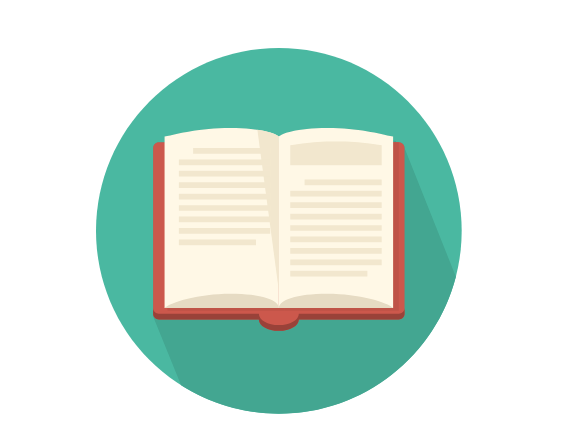

learning log
======================================

    

聚沙成塔，集腋成裘，终于一天会成为大牛

>记录自己每一天的收获

## 2018

* [2018-7](https://github.com/1810824959/notes/blob/master/2018-7.md)

* [2018-8](https://github.com/1810824959/notes/blob/master/2018-8.md)

* [2018-9](https://github.com/1810824959/notes/blob/master/2018-9.md)

* [2018-10](https://github.com/1810824959/notes/blob/master/2018-10.md)

* [2018-11](https://github.com/1810824959/notes/blob/master/2018-11.md)

* [2018-12](https://github.com/1810824959/notes/blob/master/2018-12.md)

	### 我发现人和人的差距慢慢在变大。
	### 过年的时候初中同学邀请我参加婚礼，我才意识到，他已经走完了人生大半要经历的事情，而我好像才刚刚要开始。他婚礼上我敬了他酒，同桌的曾经的同学俨然一副社会人的样子，我活脱脱像个高中生，似乎一场高考下来所有人都长大了，只有我没有。他们说着什么家长里短，哪里的房租更低，谁谁谁在哪里上班，我突然觉得很不适应。
	### 这里不存在什么谁比谁更优秀，我只是感叹，同样的人，怎么就因为一场高考变得不一样了，有的一夜长大，开始接触社会百态，有的就像我，躲在象牙塔里像个鸵鸟一样不去管外面的世界，似乎所有人都长大了，只有我，停在原地。
	### 我有许多想做的事情，有很早以前就想见的人，有从来也没有忘记的人，我不想以后再遇见，我只能远远看着人家，却无法靠近。新的一年，要做的事情还很多
	### ————2019.2

## 2019

* [2019-1](https://github.com/1810824959/notes/blob/master/2019-1.md)

* [2019-2](https://github.com/1810824959/notes/blob/master/2019-2.md)

* [2019-3](https://github.com/1810824959/notes/blob/master/2019-3.md)

* [2019-4](https://github.com/1810824959/notes/blob/master/2019-4.md)

* [2019-5](https://github.com/1810824959/notes/blob/master/2019-5.md)

* [2019-6](https://github.com/1810824959/notes/blob/master/2019-6.md)

* [2019-7](https://github.com/1810824959/notes/blob/master/2019-7.md)   

 	### 校招，我来了         ————2019.6

	### 这个笔记已经坚持了两年了，最初是写在本子上的，后来才是写到了github，第一个访客是一位百度的面试官，他说写的像流水账，下一位是一个游客，默默给我点了个star，第三个是刚才打电话来的阿里面试官。

	### 我其实觉得自己是不如人的，从高中到大学，再到现在的秋招，每一次遭遇都好像在和我说，你的确有点菜。就像这个博客，我写起来也只是给自己看，说是博客都有点往脸上贴金，我每次过来看看，一边是复习，另一边又是对自己说，你看，我都坚持了这么久了，没理由去放弃啊。

	### 刚才面试官和我聊了很多，我到后面也没觉得是在面试，像是在谈心，他和我说本来我是够不上面试的，就是因为这个博客，才给了我一次机会，他想和我聊聊，看看我为什么坚持了这么久。

	### 哪有什么坚持啊，我就是因为什么都不懂，才什么都想去要啊。我每天都坚持学一点东西，晚上睡觉如果觉得自己荒废了一天，就会心疼的睡不着，但是，我什么时候，才能去找找我自己到底想要什么，或者说，我自己到底为什么会这样啊

	### 面试官最后说，我现在就算不行，以后也一定可以进阿里的，我记下了，今天我没有去问他的名字，他也很心领神会的没有说，但我以后一定会去找他的，算是给自己一个交代吧
